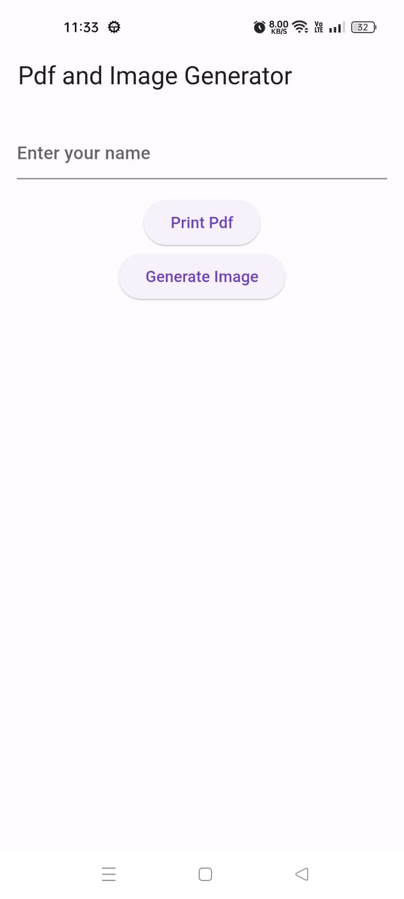
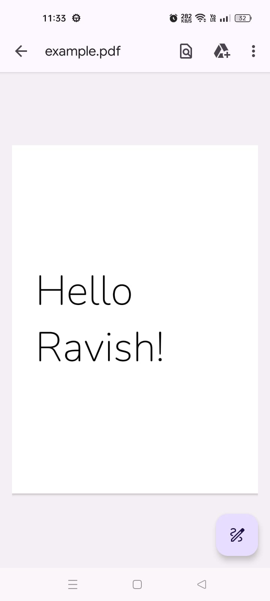
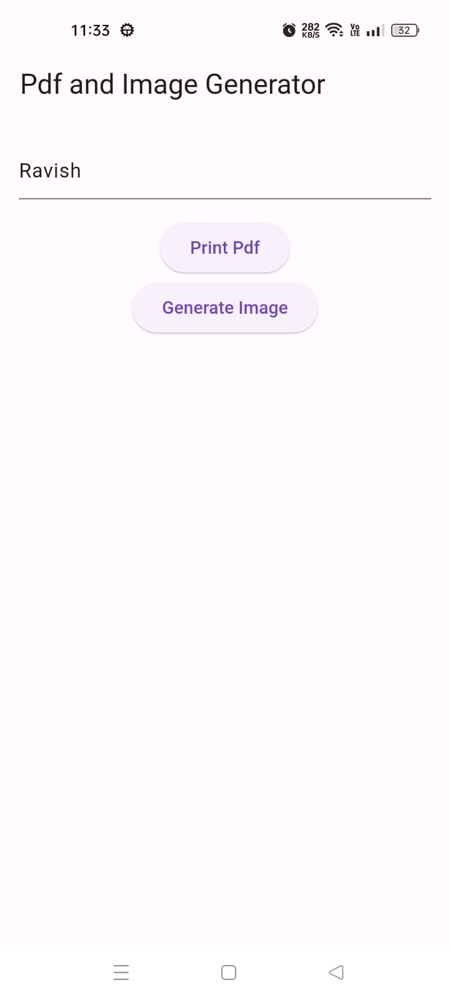

# PDF Generator App

This Flutter application allows users to input text, select an image, and generate a PDF document with the embedded image and text. The generated PDF can then be downloaded and saved locally.

## Features

- **Text Input:** Users can enter custom text to be embedded in the PDF.
- **Image Selection:** Users can choose an image from their gallery or take a new picture.
- **PDF Generation:** The app generates a PDF document with the selected image and input text.
- **Download and Save:** Users can download the generated PDF to their device.

## Screenshots






## Getting Started

### Prerequisites

Make sure you have the following installed:

- **Flutter SDK:** [Install Flutter](https://flutter.dev/docs/get-started/install)
- A device or emulator to run the application

### Installation

1. **Clone the repository:**

   ```bash
   git clone https://github.com/yourusername/pdf_generator_app.git
   cd pdf_generator_app
